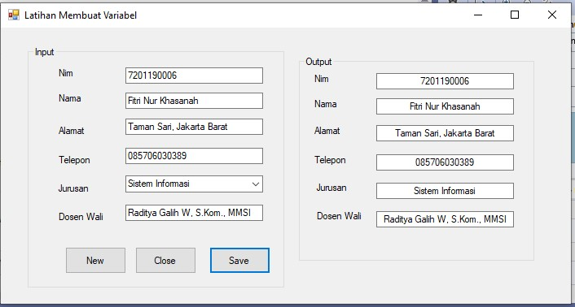

# LATIHAN PERTEMUAN 3 #

## Latihan Membuat Variabel ##

Public Class Form1

    Private Sub Form1_Load(ByVal sender As System.Object, ByVal e As System.EventArgs) Handles MyBase.Load
        Me.Text = "Latihan Membuat Variabel"
    End Sub

    Private Sub btnNew_Click(sender As Object, e As EventArgs) Handles btnNew.Click
        Dim a, b, c, d, g, f As String
        a = "Masukan Nim"
        b = "Masukan Nama"
        c = "Masukan Alamat"
        d = "Masukan Telepon"
        g = "Masukan Jurusan"
        f = "Masukan Dosen Wali"

        txtnim.Text = a
        txtnama.Text = b
        txtalamat.Text = c
        txttelepon.Text = d
        cmbjurusan.Text = g
        txtdosenwali.Text = f

    End Sub

    Private Sub btnClose_Click(sender As Object, e As EventArgs) Handles btnClose.Click
        Me.Close()
    End Sub

    Private Sub btnSave_Click(sender As Object, e As EventArgs) Handles btnSave.Click
        TextBox6.Text = txtnim.Text
        TextBox7.Text = txtnama.Text
        TextBox8.Text = txtalamat.Text
        TextBox9.Text = txttelepon.Text
        TextBox10.Text = cmbjurusan.Text
        TextBox11.Text = txtdosenwali.Text
    End Sub
End Class

### Hasil run 

