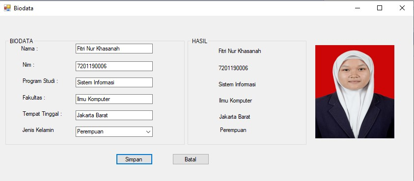

# LATIHAN PERTEMUAN 2

### Koding Pemrograman :

Public Class Form1

    Private Sub Form1_Load(ByVal sender As System.Object, ByVal e As System.EventArgs) Handles MyBase.Load
        Me.Text = "Biodata"
        Label1.Text = "Nama :"
        Label2.Text = "Nim :"
        Label3.Text = "Program Studi :"
        Label4.Text = "Fakultas :"
        Label5.Text = "Tempat Tinggal :"
        Label6.Text = "Jenis Kelamin"
        Button1.Text = "Simpan"
        Button2.Text = "Batal"
        GroupBox1.Text = "BIODATA"
        GroupBox2.Text = "HASIL"
    End Sub

    Private Sub Button1_Click(sender As Object, e As EventArgs) Handles Button1.Click
        Label7.Text = TextBox1.Text
        Label8.Text = TextBox2.Text
        Label9.Text = TextBox3.Text
        Label10.Text = TextBox4.Text
        Label11.Text = TextBox5.Text
        Label12.Text = ComboBox1.Text

    End Sub
End Class

### Hasil run :

